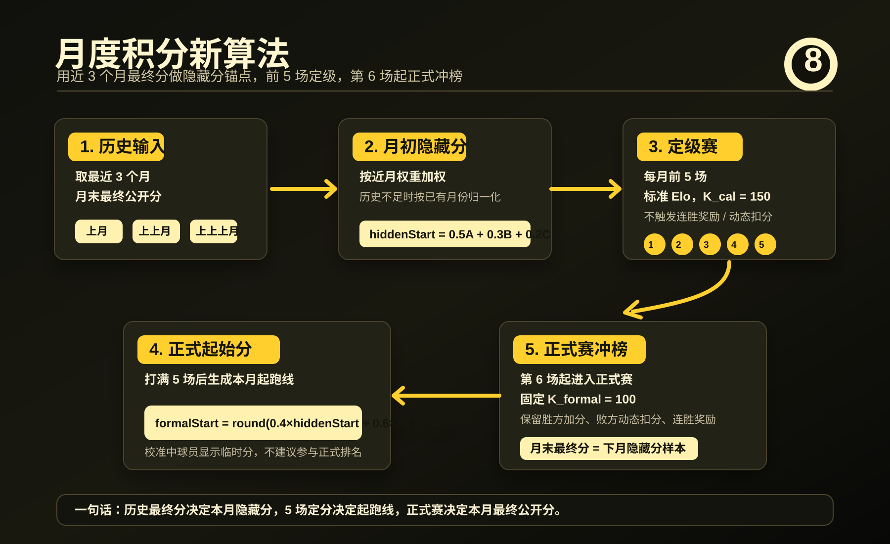

# 积分算法更新日志

## 隐藏分 + 定分赛 + 正式赛



本次算法把“长期实力锚点”和“当月冲榜表现”拆开：每月不再完全从 `1000` 盲开，而是先用近 3 个月的月末最终分生成当月隐藏分，再通过前 5 场定级赛校准正式起跑线。

### 规则变更

- 月初隐藏分改为最近 3 个月月末最终分的加权平均：最近月 `0.5`，上上月 `0.3`，上上上月 `0.2`。
- 历史不足 3 个月时，只按已有月份重新归一化；完全无历史时默认 `1000`。
- 每月前 5 场为定级赛，使用标准 Elo 公式，固定 `K_cal = 150`。
- 定级赛的目标是校准月初隐藏分，不是直接做正式冲榜；只要一场比赛中任意一方仍未完成 5 场定级，这场就按校准场处理，只看基础胜负变化，不触发正式赛的连胜延续奖励、终结连胜奖励，也不使用败方动态扣分。
- 校准场里双方按各自状态取 K 值：未完成定级的一方用 `K_cal = 150`，已完成定级的一方用 `K_formal = 100`，因此混合状态对局的正负分可能不完全相等。
- 打满 5 场后生成本月正式起始分：`formalStart = round(0.4 × 月初隐藏分 + 0.6 × 定分后分数)`。
- 第 6 场起进入正式赛，保留现有胜方加分、败方动态扣分、连胜延续奖励和终结连胜奖励，但正式赛 K 固定为 `100`。
- 月末隐藏分样本直接取当月最终公开分，用作之后月份的加权历史输入。

### 计算流程

```text
近 3 个月最终公开分
        ↓
本月月初隐藏分
        ↓
前 5 场定级赛，K_cal = 150
        ↓
确定本月正式起始分
        ↓
第 6 场起正式赛，K_formal = 100
        ↓
本月最终公开分
        ↓
成为后续月份隐藏分样本
```

### 展示变化

- 球员预览页新增“月度隐藏分”卡片，显示月初隐藏分、定分后分数、正式起始分和当前月最终分。
- 球员预览页新增“每月隐藏分”列表，可回看每个月的隐藏分样本和定分状态。
- 比赛历史、CSV 导出、Slack 战报继续从比赛历史回放得出分数，不额外持久化隐藏分。

### 设计取舍

这套机制让老玩家不再每月从 `1000` 完全重开，同时仍保留当月赛季的可冲榜空间。前 5 场负责把隐藏分校准到更靠谱的起跑线，第 6 场以后才进入正式赛，避免短期少量比赛直接放大为正式排名波动。
